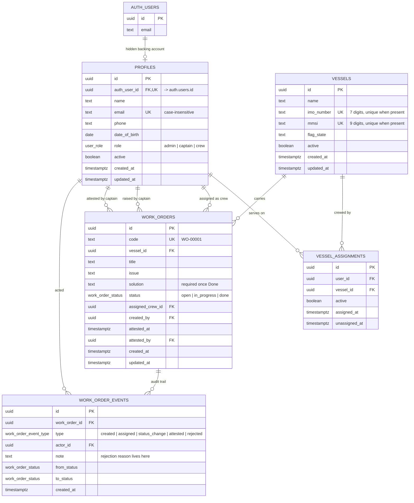

# Marine Work Order Management System

Vessel-scoped work orders, crew management and role-based operations for a small
fleet — built on **Next.js (App Router) + TypeScript + Supabase**, with no login
screen anywhere. A reviewer picks a vessel, a role and a member from the Identity
Bar, and the app behaves exactly as if that person had signed in: their data
scope, their permissions, their available actions.

The trick is that the impersonation is real. Each mock user is backed by a
hidden Supabase Auth account; selecting them mints a genuine session, so
`auth.uid()` is real and **every authorization decision is made by PostgreSQL
Row Level Security**, not by the interface.

---

## Contents

- [Quick start](#quick-start)
- [Deployment](#deployment)
- [ERD](#erd)
- [How the mock auth works](#how-the-mock-auth-works)
- [Security model](#security-model)
- [Work order lifecycle](#work-order-lifecycle)
- [Business rules and guardrails](#business-rules-and-guardrails)
- [Concurrency](#concurrency)
- [Project layout](#project-layout)
- [Testing](#testing)
- [Demo accounts](#demo-accounts)

---

## Quick start

**1. Create a Supabase project** at [supabase.com](https://supabase.com) (any
region). Note the project URL and both API keys.

**2. Apply the schema.** Open the Supabase SQL Editor and run, in order:

```
supabase/migrations/0001_schema.sql      -- tables, constraints, indexes, triggers
supabase/migrations/0002_rls.sql         -- session helpers + Row Level Security
supabase/migrations/0003_functions.sql   -- lifecycle RPCs + admin guardrails
```

`supabase/schema.sql` is the same three files concatenated, if you would rather
paste once. All of it is idempotent — re-running is safe.

**3. Configure the app.**

```bash
cp .env.example .env.local     # then fill in the four values
npm install
```

`IMPERSONATION_SECRET` can be anything long and random (`openssl rand -base64 32`).
It is the seed for each hidden account's credential, so changing it later means
re-seeding.

**4. Seed the demo fleet** — three vessels, ten people, ten work orders spread
across every lifecycle state:

```bash
npm run db:seed      # idempotent
npm run db:reset     # wipe and rebuild from scratch
```

**5. Run it.**

```bash
npm run dev          # http://localhost:3000
```

Pick anyone from the Identity Bar and start clicking.

---

## Deployment

### Vercel

1. Push this repository to GitHub.
2. In Vercel, **Add New → Project**, import the repo. The framework preset is
   detected automatically; no build settings need changing.
3. Add four environment variables (Production, Preview and Development):

   | Variable | Value |
   |---|---|
   | `NEXT_PUBLIC_SUPABASE_URL` | your project URL |
   | `NEXT_PUBLIC_SUPABASE_ANON_KEY` | anon / publishable key |
   | `SUPABASE_SERVICE_ROLE_KEY` | service_role key — **never** prefix with `NEXT_PUBLIC_` |
   | `IMPERSONATION_SECRET` | the same value you seeded with |

4. Deploy. Nothing else is required — there are no redirect URLs or auth
   callbacks to configure, because there is no login flow.

### Netlify

Same four variables; build command `npm run build`, and install
`@netlify/plugin-nextjs` (Netlify adds it automatically for Next projects).

### Keeping the database awake

Supabase's free tier pauses a project after a stretch of inactivity, which would
take the live URL down mid-review. Either move the project to a paid tier, or
ping it on a schedule — a Vercel Cron hitting any page once a day is enough.

---

## ERD



Notes on the shape:

- **`imo_number` and `mmsi` are each independently unique** where present.
  IMO is permanent for the hull's life; MMSI changes with flag or ownership but
  may not be shared by two vessels at once. IMO is only mandatory for propelled
  seagoing ships of 100+ GT, so a partial unique index on
  `(name, mmsi, flag_state)` covers craft without one.
- **`vessel_assignments` is a soft-deactivated join**, not a delete. History
  stays intact and foreign keys always resolve.
- **Attestation and rejection are not statuses.** The brief allows exactly three
  statuses, so approval is `attested_at`/`attested_by` on the row, and the full
  reviewer trail — every rejection reason, every transition, who and when — lives
  in `work_order_events` rather than in a single overwritable note field.

---

## How the mock auth works

The original brief pulls in three directions at once: browser-side Supabase
calls, real RLS authorization, and no login flow. Plain anon-key RLS keys off
`auth.uid()`, which does not exist without a session — so without addressing
this, either the policies cannot tell who is asking, or the app quietly falls
back to client-side checks that a reviewer can bypass with the browser console.

The resolution is **hidden pre-seeded auth accounts**:

```
Identity Bar: pick "Capt. Ana Mora"
      │
      ▼
POST /api/impersonate { profileId }          (server, service-role key)
      │  looks the profile up server-side, checks it is active,
      │  derives that account's credential from IMPERSONATION_SECRET,
      │  exchanges it for a real Supabase session
      ▼
supabase.auth.setSession({ access_token, refresh_token })   (browser)
      │
      ▼
Every subsequent query carries a real JWT.
auth.uid() resolves. RLS applies. The database itself now believes
it is talking to Ana Mora, because it is.
```

Consequences worth noting:

- The profile id is the **only** client-supplied input to that route, and it is
  validated as a UUID before it touches the database. The email and credential
  are resolved server-side, so a caller cannot request a session for an
  arbitrary address.
- No credential ever reaches the browser. It is derived, not stored — rotating
  `IMPERSONATION_SECRET` invalidates every backing account at once.
- **Session persistence is free.** `supabase-js` already persists the session in
  local storage and refreshes it, so a page reload keeps you signed in as
  whoever was last selected. No custom persistence layer exists in this codebase.
- A deactivated profile is refused at the route *and* dropped on the next load,
  so a session cannot outlive the account.

---

## Security model

Everything below is in `supabase/migrations/0002_rls.sql` and
`0003_functions.sql`, and is exercised by the test suite in
`scripts/test-policies.sql`.

**RLS is on and forced for all five tables.** The `anon` role has *no* table
privileges at all — not even `select`. A visitor who has not picked an identity
can reach exactly two functions, `identity_vessels()` and `identity_members()`,
which return vessel names and the display name + role of active members. No
email, no phone, no date of birth, no work order data. That is the deliberate
equivalent of a login page listing its demo accounts.

Once signed in:

| Table | Read | Write |
|---|---|---|
| `vessels` | Admin: all. Captain/Crew: vessels they are actively assigned to. | Admin only |
| `profiles` | Admin: all. Others: themselves + anyone sharing an active vessel. | Admin only |
| `vessel_assignments` | Admin: all. Others: their own + their vessels' rows. | Admin only |
| `work_orders` | Admin: all. Captain/Crew: their assigned vessels. | **No policy — RPC only** |
| `work_order_events` | Follows the parent work order. | **No policy — RPC only** |

Work orders carry no `INSERT`/`UPDATE`/`DELETE` policy by design. Every state
change goes through a `SECURITY DEFINER` function that re-derives the caller from
`auth.uid()`, re-checks role and vessel assignment, enforces the legal
transition, applies the concurrency guard and appends the audit event — all in
one transaction. A crew member cannot skip a step, a captain cannot attest on a
vessel they do not command, and nobody can write an event that did not happen.

Other deliberate choices:

- **No table has a `DELETE` policy.** Records are deactivated, never destroyed.
- Every helper and RPC pins `search_path = public, pg_temp`, so a `SECURITY
  DEFINER` function cannot be hijacked by a shadowing object.
- Default `EXECUTE` grants are revoked from `PUBLIC` and handed back explicitly
  per role, rather than relying on PostgreSQL's permissive default.
- **Injection:** no SQL string is ever assembled in the browser. Reads go through
  PostgREST with bound filters; writes go through RPCs with typed arguments. The
  single free-text filter (work order search) strips PostgREST pattern
  metacharacters before it is used.
- The service-role key is imported only in files marked `server-only`, and is
  used for exactly two things: minting an impersonation session, and creating or
  updating the hidden auth account behind a profile. Both routes verify the
  caller's own JWT maps to an active Admin first — and if that check were
  bypassed, RLS would still refuse the write.
- Role escalation is closed: a Crew member updating their own `profiles.role`
  matches no rows under RLS and silently changes nothing.

---

## Work order lifecycle

```
        Captain raises                Crew picks up            Crew documents
        + assigns crew                                          the solution
   ────────────────────►  Open  ────────────────────►  In Progress  ────────────────────►  Done
                                                            ▲                                │
                                                            │                                │
                                            Captain rejects │                                │ Captain attests
                                            (reason required)│                               ▼
                                                            └──────────────────────────  Done · attested
                                                                                          (closed)
```

Exactly three statuses, as specified. `Done` is not terminal until it is
attested — a captain can still send it back, which is why the guardrails below
treat an unattested `Done` order as live work.

---

## Business rules and guardrails

**Roles** are single and mutually exclusive (`admin` / `captain` / `crew`), per
least-privilege RBAC guidance against stacking roles.

**Assignment**

- Crew may be assigned to several vessels at once — small fleets share relief
  staff. Enforced as a plain many-to-many.
- A Captain holds **at most one active command**, enforced by a `BEFORE` trigger
  on `vessel_assignments` rather than trusted to the UI.
- Admins are fleet-wide and cannot be assigned to a vessel at all.

**Duplicate detection for users** is tiered:

- *Tier 1, hard:* email is unique at the database level (case-insensitively), and
  also identifies the hidden backing auth account.
- *Tier 2, soft:* matching name **and** phone **and** date of birth against an
  active user raises a "possible duplicate" warning the Admin can accept or
  cancel — two different people can legitimately share all three, so this is
  deliberately not a block.

**Duplicate detection for vessels** is a hard block, enforced by two
independent unique indexes rather than one composite key: `imo_number` and
`mmsi` may each not be shared by two vessels, and craft with neither fall back
to a `(name, mmsi, flag_state)` unique index. The UI checks all three against
the already-loaded vessel list as you type, before the database ever has to
reject the write.

**Deactivation guardrails** (all enforced in the database, all with a message
naming the exact blocking records):

| Action | Blocked when |
|---|---|
| Deactivate Crew | they hold **any** work order not yet attested — `Open`, `In Progress`, or unattested `Done` |
| Deactivate Captain | they are the sole active Captain of an active vessel |
| Remove a Captain's assignment | same rule — the vessel would have nobody to raise or attest work |
| Remove a Crew assignment | they hold unattested work orders on that vessel |
| Deactivate Admin | it is the last active Admin, or the account you are currently using |
| Deactivate a vessel | it carries any work order not yet attested |

An unattested `Done` order counts as live in every one of these, because a
Captain can still reject it back to `In Progress`. Deactivating the assignee in
between would hand active work to an inactive owner.

When a guardrail fires, the Admin screens surface the blocking work order codes
so the reassign-or-attest path is obvious. `wo_reassign` exists precisely so an
Admin can clear the way.

---

## Concurrency

Two devices can hold the same mock identity at once. That is expected — it is
the same as one person signed in on a laptop and a phone — and it is not a
security concern, so there is no session locking, no presence tracking and no
heartbeat infrastructure to go stale.

What *is* guarded is the write. Every status-changing call sends the state the UI
believed was current:

```ts
supabase.rpc("wo_attest", {
  p_id: workOrder.id,
  p_expected_status: workOrder.status,      // what this device last saw
  p_expected_attested: attested,
});
```

The RPC applies its `UPDATE` only if those still match, inside one statement. If
another device got there first the write affects zero rows and the function
raises `CONFLICT`, which the UI shows as *"this work order was already updated on
another device — refresh to see the latest"* and then refetches. Attest and
reject guard on status **and** attestation together, so a near-simultaneous
attest and reject on the same `Done` order cannot both land.

Supabase Realtime is subscribed to `work_orders`, so in practice the second
device usually re-renders before its user clicks anything. The guard is what
makes it correct; realtime just makes it pleasant.

---

## Project layout

```
supabase/migrations/    0001 schema · 0002 RLS · 0003 RPCs and guardrails
supabase/schema.sql     all three concatenated, for one-paste setup

scripts/seed.ts               demo fleet + hidden auth accounts
scripts/test-policies.sql     44 assertions over RLS, lifecycle and guardrails
scripts/local-supabase-stub.sql   fakes auth.uid()/auth.users for local testing
scripts/visual-check.mjs      responsive screenshots with stubbed network

src/app/                Next.js App Router pages
  api/impersonate/        the mock-auth sign-in
  api/admin/users/        the only two writes needing the service-role key
src/components/         Identity Bar, work order screens, admin screens, UI kit
src/lib/
  supabase/client.ts      the single anon-key browser client
  supabase/admin.ts       server-only service-role clients
  session.tsx             who am I, what vessel am I looking at
  database.types.ts       typed mirror of the SQL schema
  queries.ts              every read, in one place
  errors.ts               CODE: message → typed UI treatment
```

Data access is uniform: the browser client with the anon key, under RLS. The two
server routes exist only because creating a Supabase Auth account is not
something an anon key can do.

---

## Testing

**Database behaviour** — 44 assertions covering the lifecycle, every RLS policy,
the concurrency guard and every guardrail. Runs against a scratch PostgreSQL 15+
database; no Supabase project needed.

```bash
createdb marine
psql -v ON_ERROR_STOP=1 -d marine -f scripts/local-supabase-stub.sql
psql -v ON_ERROR_STOP=1 -d marine -f supabase/migrations/0001_schema.sql
psql -v ON_ERROR_STOP=1 -d marine -f supabase/migrations/0002_rls.sql
psql -v ON_ERROR_STOP=1 -d marine -f supabase/migrations/0003_functions.sql
psql -v ON_ERROR_STOP=1 -d marine -f scripts/test-policies.sql
```

A sample of what it proves:

```
ok  captain cannot hold two active commands
ok  captain cannot raise work on a vessel she does not command
ok  non-assignee crew cannot pick up the order
ok  stale expected-status write is rejected          -> CONFLICT
ok  reject cannot race an attest that already landed -> CONFLICT
ok  crew with an unattested Done order cannot be deactivated
ok  a captain sees no work orders from vessels he does not command
ok  crew cannot escalate their own role (RLS matches no rows)
ok  anon cannot read profiles directly               -> permission denied
ok  the last active admin can never be deactivated
```

**Application** —

```bash
npm run typecheck    # tsc --noEmit, strict
npm run lint         # eslint, next/core-web-vitals + next/typescript
npm run build        # production build
```

**Responsive check** — with the app running, `node scripts/visual-check.mjs`
writes desktop / tablet / phone screenshots with the network stubbed, and fails
on any uncaught runtime error.

---

## Demo accounts

Seeded by `npm run db:seed`. Pick any of them in the Identity Bar; there is no
password to type anywhere.

| Person | Role | Vessel |
|---|---|---|
| Inés Okonkwo | Admin | fleet-wide |
| Dmitri Halvorsen | Admin | fleet-wide |
| Capt. Ana Mora | Captain | MV Northern Star |
| Capt. Tomas Reyes | Captain | MV Coral Dawn |
| Capt. Nora Blake | Captain | Harbour Tender Pelican |
| Miguel Santos | Crew | MV Northern Star |
| Funke Adeyemi | Crew | MV Northern Star + Harbour Tender Pelican |
| Erik Larsen | Crew | MV Coral Dawn |
| Yui Nakamura | Crew | MV Coral Dawn |
| Tunde Oyelaran | Crew | Harbour Tender Pelican |

### A five-minute tour

1. Sign in as **Capt. Ana Mora**. Raise a work order on MV Northern Star and
   assign it to Miguel Santos.
2. Switch to **Miguel Santos**. The order is on his board. Pick it up, then
   complete it with a solution.
3. Switch back to **Ana Mora** and *reject* it with a reason. It returns to In
   Progress; the reason is on the work order's history for good.
4. As Miguel, complete it again. As Ana, attest it. Now it is closed.
5. Switch to **Capt. Tomas Reyes** — MV Northern Star is not even in his vessel
   list, and its work orders are invisible to him. That is RLS, not a filter.
6. Switch to **Inés Okonkwo** (Admin) and try to deactivate Miguel Santos while
   he still holds an unattested order. The database refuses and names the order.
