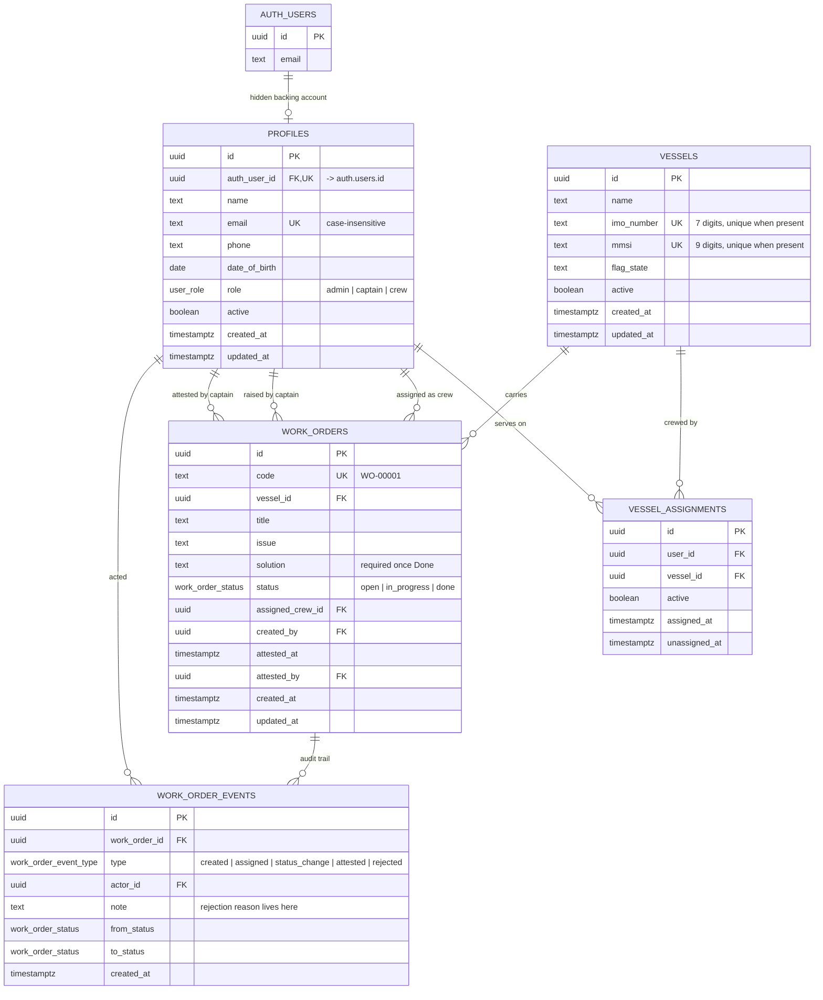

# Marine Work Order Management System

A small dashboard for running work orders, crew and vessels across a fleet of
ships — built with Next.js, TypeScript and Supabase. There's no login screen
anywhere. Instead, you pick who you are from a bar at the top of the page, and
the app shows you exactly what that person would see if they'd logged in
themselves.

That "picking who you are" isn't just cosmetic. Every mock user in this app is
backed by a real, hidden Supabase Auth account. When you select someone from
the Identity Bar, you're actually signing in as them — `auth.uid()` becomes a
genuine value, and every permission check from that point on is enforced by
PostgreSQL's Row Level Security, not by the interface deciding what to show
you.

---

## Contents

- [Quick start](#quick-start)
- [Deployment](#deployment)
- [ERD](#erd)
- [Assumptions and decisions I made](#assumptions-and-decisions-i-made)
- [Where I went further than asked](#where-i-went-further-than-asked)
- [How permissions are enforced](#how-permissions-are-enforced)
- [The work order lifecycle](#the-work-order-lifecycle)
- [Business rules and guardrails](#business-rules-and-guardrails)
- [Demo accounts](#demo-accounts)

---

## Quick start

**1. Create a Supabase project** at [supabase.com](https://supabase.com) — any
region works. Grab the project URL and both API keys from Project Settings.

**2. Apply the schema.** Open the Supabase SQL Editor and run these three
files, in order:

```
supabase/migrations/0001_schema.sql      -- tables, constraints, indexes, triggers
supabase/migrations/0002_rls.sql         -- session helpers + Row Level Security
supabase/migrations/0003_functions.sql   -- lifecycle functions + admin guardrails
```

Or just paste `supabase/schema.sql` once — it's the same three files
concatenated. Everything is written so it's safe to re-run.

**3. Configure the app.**

```bash
cp .env.example .env.local     # then fill in the four values
npm install
```

`IMPERSONATION_SECRET` can be any long random string
(`openssl rand -base64 32` works fine). It's used to derive each hidden
account's password, so if you change it later you'll need to re-seed.

**4. Seed the demo fleet** — three vessels, ten people, ten work orders spread
across every stage of the lifecycle:

```bash
npm run db:seed      # safe to run again
npm run db:reset     # wipe and rebuild from scratch
```

**5. Run it.**

```bash
npm run dev          # http://localhost:3000
```

Pick anyone from the Identity Bar and start clicking around.

---

## Deployment

### Vercel

1. Push the repo to GitHub.
2. In Vercel, **Add New → Project**, import it. The framework is detected
   automatically — nothing to configure there.
3. Add the same four environment variables from your `.env.local`
   (Production, Preview and Development):

   | Variable                        | Value                                                        |
   | ------------------------------- | ------------------------------------------------------------ |
   | `NEXT_PUBLIC_SUPABASE_URL`      | your project URL                                             |
   | `NEXT_PUBLIC_SUPABASE_ANON_KEY` | anon / publishable key                                       |
   | `SUPABASE_SERVICE_ROLE_KEY`     | service*role key — never prefix this one with `NEXT_PUBLIC*` |
   | `IMPERSONATION_SECRET`          | the same value you seeded with                               |

4. Deploy. That's it — there's no redirect URL or auth callback to set up,
   because there's no login flow to configure.

### Netlify

Same four variables, build command `npm run build`. Netlify adds
`@netlify/plugin-nextjs` for you automatically on a Next.js project.

### Keeping the database awake

Supabase's free tier pauses a project after a while of no activity, which
would quietly take the live demo down. Either move to a paid tier, or ping
the site on a schedule so it never goes idle — a daily Vercel Cron hitting
any page is enough.

---

## ERD



Notes on the shape:

- **`imo_number` and `mmsi` are each independently unique** where present.
  IMO is permanent for the hull's life; MMSI changes with flag or ownership but
  may not be shared by two vessels at once. IMO is only mandatory for propelled
  seagoing ships of 100+ GT, so a partial unique index on
  `(name, mmsi, flag_state)` covers craft without one.
- **`vessel_assignments` is a soft-deactivated join**, not a delete. History
  stays intact and foreign keys always resolve.
- **Attestation and rejection are not statuses.** The brief allows exactly three
  statuses, so approval is `attested_at`/`attested_by` on the row, and the full
  reviewer trail — every rejection reason, every transition, who and when — lives
  in `work_order_events` rather than in a single overwritable note field.

---

## Assumptions and decisions I made

The brief left a few things open to interpretation. Here's what I decided,
and why — these were conscious calls, not guesses I happened to land on.

- **The vessel dropdown gives Admins an "All Vessels" option.** Admins aren't
  tied to a single ship, so they need a fleet-wide view. Captains and Crew
  only ever see vessels they're actually assigned to.
- **One role per person, and roles don't stack.** Someone is an Admin, a
  Captain, or Crew — never a combination. This is the standard
  least-privilege approach, and it also matches the brief's Role Filter,
  which treats role as a single value rather than a set.
- **Vessels are keyed on IMO number first.** It's permanent for the life of
  the hull. Smaller craft under 100 gross tons aren't required to carry an
  IMO number, so for those I fall back to a combination of Name, MMSI and
  Flag State.
- **User duplicate checking has two tiers.** Email is a hard, database-level
  unique key — it's also tied to the hidden auth account, so it genuinely
  can't repeat. Name, phone and date of birth all matching is treated as a
  warning instead, because two different people can legitimately share all
  three, and I didn't want the system to block a real person over a
  coincidence.
- **Crew can serve on more than one vessel; a Captain can only command one at
  a time.** Small fleets often share crew across ships for relief coverage,
  but a vessel only ever has one Captain actively in charge.
- **Two devices can be signed in as the same mock person at once, and that's
  fine.** It's really no different from one person being logged in on a
  laptop and a phone. Rather than build session locking to prevent it, I
  just made sure that if two devices try to change the same work order at
  nearly the same moment, only one write wins and the other gets a clear
  "this was already updated" message instead of silently overwriting
  anything.
- **The seed data is a starting point, not a boundary.** Admins can still
  create, edit and deactivate anything on top of it — the seeded fleet just
  gives a reviewer something to look at immediately.

---

## Where I went further than asked

A few things in here weren't explicitly requested, but felt worth doing
properly once I was already in the area.

- **A minimum age rule, based on real maritime regulation.** Crew must be at
  least 16, and Admins and Captains at least 18 — this comes from the MLC
  2006 seafarer age minimums, not a number I picked arbitrarily. The date
  picker itself won't let you select an underage date.
- **Phone and email fields clean up after you as you type.** Phone numbers
  only accept digits, a leading `+`, and single spaces — no more collapsing
  double spaces or stray punctuation. Email addresses are lowercased
  automatically, and are checked for duplicates against the list already on
  screen before you even hit save, so you find out immediately instead of
  after a round trip to the server.
- **The duplicate warning tells you who, not just that.** If a new user's
  date of birth, name and phone all match someone existing, the popup shows
  their name, role and vessel, and exactly which fields matched — so an
  Admin can actually make a judgment call instead of guessing.
- **MMSI got its own real uniqueness rule**, not just a fallback for vessels
  without an IMO number. Two vessels can no longer share an MMSI at all, and
  if a save fails, the error names the specific field that collided (IMO,
  MMSI, or the name/MMSI/flag combination) instead of one generic message.
- **Assigning crew to a vessel follows a sensible order.** An empty vessel
  can only be assigned a Captain first — you can't staff a ship with Crew
  before it has someone in charge. Once it has a Captain, the list opens up
  to everyone eligible.
- **Attestation and rejection are backed by a full audit trail, not just a
  status flip.** Every rejection reason, every attest, every status change is
  written to its own event log with who did it and when — so nothing is ever
  overwritten or lost, and a Captain can look back at the entire history of a
  work order, not just its current state. This is also where the guardrails
  live: the system won't let an Admin deactivate someone, or stand a Captain
  down, while they're still needed to close out active work.
- **I closed a permission gap that isn't visible from the UI.** Early on,
  the `vessel_assignments` table technically allowed an Admin's raw
  database call to bypass the same guardrails described above — for
  example, removing the only Captain from a vessel directly, skipping the
  check that normally prevents it. I tightened that so every write to
  that table has to go through the same guarded function the UI already
  uses, the same way work orders already worked. Nothing in the app changed
  because of it — the app never wrote to that table directly in the first
  place — it just closes a door that shouldn't have been open.

---

## How permissions are enforced

All of this lives in `supabase/migrations/0002_rls.sql` and
`0003_functions.sql`, and it's exercised by the 44 checks in
`scripts/test-policies.sql`.

Row Level Security is turned on for every table, and nobody — not even an
Admin — can bypass it by accident. Someone who hasn't picked an identity yet
can't read anything from the tables directly; the only things available
before sign-in are two narrow functions that return vessel names and the
display names and roles of active members. No email, no phone, no work order
data. It's the same amount of information a login page's list of demo
accounts would show you.

Once someone is signed in:

| Table                | Who can read it                                                                                | Who can write to it                               |
| -------------------- | ---------------------------------------------------------------------------------------------- | ------------------------------------------------- |
| `vessels`            | Admins: everything. Captains/Crew: vessels they're actively assigned to.                       | Admin only                                        |
| `profiles`           | Admins: everything. Everyone else: themselves, plus anyone sharing an active vessel with them. | Admin only                                        |
| `vessel_assignments` | Admins: everything. Everyone else: their own rows, plus their vessels'.                        | No direct write — goes through a guarded function |
| `work_orders`        | Admins: everything. Captains/Crew: their assigned vessels.                                     | No direct write — goes through a guarded function |
| `work_order_events`  | Follows whatever work order it belongs to.                                                     | No direct write — goes through a guarded function |

Work orders and vessel assignments don't have ordinary insert/update/delete
rules at all. Every change to either one goes through a function that
re-checks who's actually asking, confirms the change is legal, applies the
concurrency check described below, and writes the audit event — all as one
atomic step. A crew member can't skip a step in the lifecycle, a captain
can't attest a work order on a vessel they don't command, and there's no way
to write a history event that didn't really happen.

A few other things worth calling out:

- Nothing is ever hard-deleted. Records get deactivated instead, so history
  and relationships stay intact.
- Every helper function pins its own search path, which closes off a known
  way these kinds of functions can be tricked into running the wrong code.
- Permissions aren't left at Postgres's defaults — they're revoked first,
  then handed back deliberately to exactly the roles that need them.
- No SQL is ever built as a string in the browser. Reads go through
  Supabase's query builder with proper bound filters, and writes go through
  typed function calls. The one place a user can type free text into a
  search (the work order search box) has any special filter characters
  stripped before it's used.
- The service-role key — the one with full access — only lives in two
  server-side files, and is used for exactly two things: signing someone in
  through impersonation, and creating or updating the hidden auth account
  behind a profile. Both of those routes double-check the caller is
  genuinely an Admin before doing anything, and even if that check were
  somehow skipped, the database's own rules would still refuse the write.
- A Crew member trying to promote themselves by editing their own role
  simply doesn't work — the update matches zero rows under the security
  rules, so nothing happens.

---

## The work order lifecycle

```
        Captain raises                Crew picks up            Crew documents
        + assigns crew                                          the solution
   ────────────────────►  Open  ────────────────────►  In Progress  ────────────────────►  Done
                                                            ▲                                │
                                                            │                                │
                                            Captain rejects │                                │ Captain attests
                                            (reason required)│                               ▼
                                                            └──────────────────────────  Done · attested
                                                                                          (closed)
```

Exactly three statuses, as the brief asks for. `Done` isn't really finished
until it's attested, though — a Captain can still send it back — which is why
every guardrail below treats an unattested `Done` order as still-active
work.

---

## Business rules and guardrails

**Roles** are single and mutually exclusive — someone is an Admin, a
Captain, or Crew, never more than one at a time.

**Assignment**

- Crew can be assigned to more than one vessel at once, for fleets that
  share relief staff.
- A Captain can only actively command one vessel at a time — enforced in the
  database itself, not just by the interface.
- Admins aren't tied to any vessel and can't be assigned to one.

**Checking for duplicate users** happens in two tiers:

- _Hard:_ email has to be unique in the database, case-insensitively, and
  it's also what identifies the hidden auth account behind a profile.
- _Soft:_ if someone's name, phone and date of birth all match an existing
  active user, the Admin sees a warning and can choose to continue or
  cancel — since two different people really can share all three.

**Checking for duplicate vessels** is a hard block rather than a warning.
IMO number and MMSI each have to be unique on their own; vessels without
either fall back to a combination of name, MMSI and flag state. The
interface checks all of this against the vessels already loaded on screen as
you type, so most of the time you'll see the problem before you even try to
save.

**Deactivation guardrails** — all enforced by the database, and all with a
message that names the specific record causing the block:

| Action                        | Blocked when                                                                             |
| ----------------------------- | ---------------------------------------------------------------------------------------- |
| Deactivate Crew               | they hold **any** work order not yet attested — Open, In Progress, or an unattested Done |
| Deactivate Captain            | they're the only active Captain on a vessel                                              |
| Remove a Captain's assignment | same reason — the vessel would be left with nobody to raise or attest work               |
| Remove a Crew assignment      | they still hold unattested work orders on that vessel                                    |
| Deactivate an Admin           | it's the last active Admin, or the account currently being used                          |
| Deactivate a vessel           | it carries any work order not yet attested                                               |

An unattested `Done` order counts as active work in every one of these
rules, because a Captain can still reject it and send it back. Deactivating
the person responsible in the meantime would leave that work with nobody
accountable for it.

When one of these guardrails stops an action, the Admin screen shows exactly
which work order is causing it, so the fix is obvious — reassign it, or get
it attested, and try again.

---

## Demo accounts

These come from `npm run db:seed`. Pick any of them in the Identity Bar —
there's no password to type anywhere.

| Person            | Role    | Vessel                                    |
| ----------------- | ------- | ----------------------------------------- |
| Inés Okonkwo      | Admin   | fleet-wide                                |
| Dmitri Halvorsen  | Admin   | fleet-wide                                |
| Capt. Ana Mora    | Captain | MV Northern Star                          |
| Capt. Tomas Reyes | Captain | MV Coral Dawn                             |
| Capt. Nora Blake  | Captain | Harbour Tender Pelican                    |
| Miguel Santos     | Crew    | MV Northern Star                          |
| Funke Adeyemi     | Crew    | MV Northern Star + Harbour Tender Pelican |
| Erik Larsen       | Crew    | MV Coral Dawn                             |
| Yui Nakamura      | Crew    | MV Coral Dawn                             |
| Tunde Oyelaran    | Crew    | Harbour Tender Pelican                    |

### A five-minute tour

1. Sign in as **Capt. Ana Mora**. Raise a work order on MV Northern Star and
   assign it to Miguel Santos.
2. Switch to **Miguel Santos**. The order shows up on his board. Pick it up,
   then mark it done with a solution written in.
3. Switch back to **Ana Mora** and reject it with a reason. It goes back to
   In Progress, and the reason stays on the work order's history for good.
4. As Miguel, complete it again. As Ana, attest it this time. It's closed.
5. Switch to **Capt. Tomas Reyes** — MV Northern Star isn't even in his
   vessel list, and its work orders are invisible to him. That's the
   database enforcing it, not a filter hiding it in the interface.
6. Switch to **Inés Okonkwo** (Admin) and try deactivating Miguel Santos
   while he still holds an unattested order. It gets refused, and the
   message names the order.
